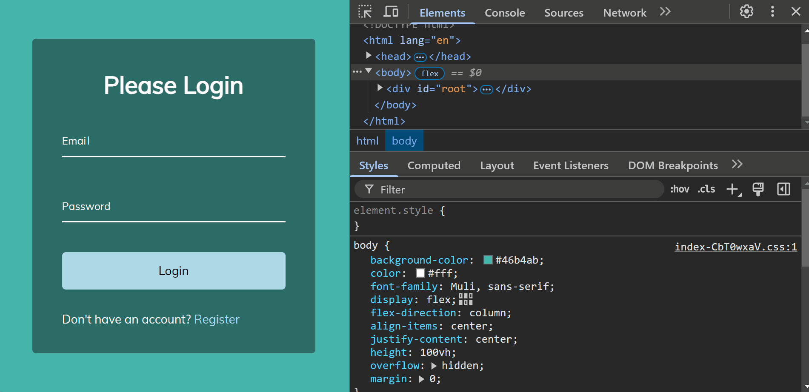

# Animated Login Form

This project implements a login form with interactive animations on the input fields. When the user interacts with the fields (focus or validation), the labels animate upwards and change color. Additionally, the design is responsive and adapts to different screen sizes.

## Screenshot

## How to Run

1. Clone the repository or create each project from scratch and the folder and file structure `npm create vite@latest projectName -- --template react`.
2. Navigate to the project folder: `cd blurry-loading`.
3. Install the dependencies: `npm install`.
4. Run the project: `npm run dev`.
5. Add `"react/prop-types": 0,` to the package.son file.

## Watch Live

[Watch Live](https://animated-login-form-ten.vercel.app/)
