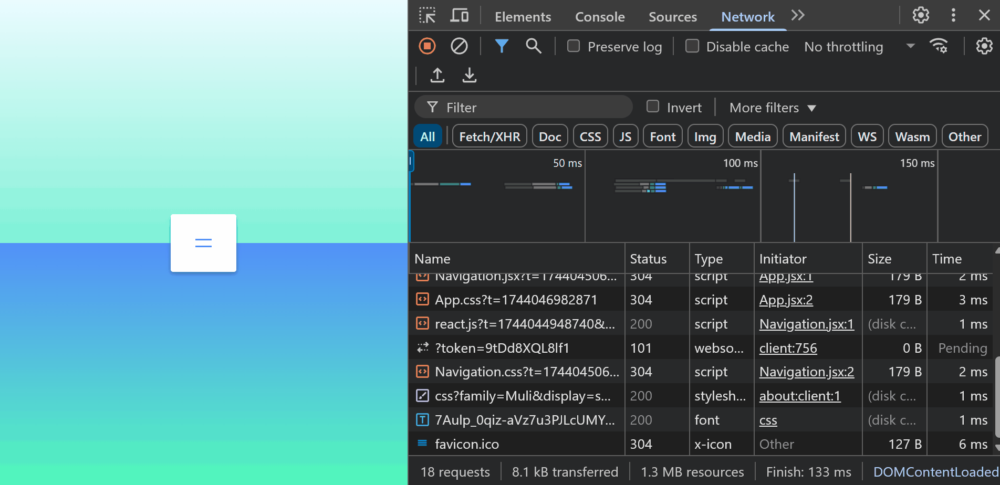

# Animated Navigation Menu

This project implements an animated navigation menu that expands and collapses with smooth animations. It's perfect for learning how to manage state and apply CSS transitions in React.

## Screenshot

## How to Run

1. Clone the repository or create each project from scratch and follow the folder and file structure `npm create vite@latest projectName -- --template react`.
2. Navigate to the project folder: `cd animated-navigation-menu`.
3. Install the dependencies: `npm install`.
4. Run the project: `npm run dev`.
5. Add `"react/prop-types": 0,` to the eslint.config.js file.

## Watch Live

[Watch Live](https://animated-navigation-menu-six.vercel.app/)
