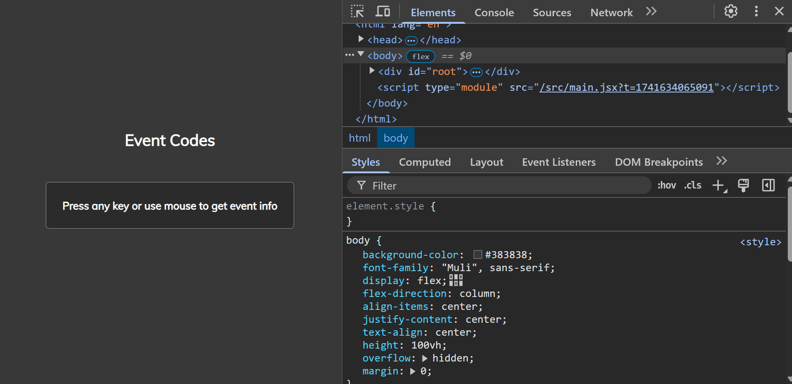

# Event KeyCodes

This project implements an interactive application that displays information about keyboard events (`event.key`, `event.keyCode`, and `event.code`) when the user presses a key, as well as mouse events (`event.type`, `event.clientX`, and `event.clientY`) when the user interacts with the mouse. It is a useful tool for developers who want to better understand how keyboard and mouse events work in JavaScript.

## Screenshot

## How to Run

1. Clone the repository or create each project from scratch and follow the folder and file structure `npm create vite@latest projectName -- --template react`.
2. Navigate to the project folder: `cd event-keycodes`.
3. Install the dependencies: `npm install`.
4. Run the project: `npm run dev`.
5. Add `"react/prop-types": 0,` to the eslint.config.js file.

## Watch Live

[Watch Live](https://event-keycodes-brown.vercel.app/)
