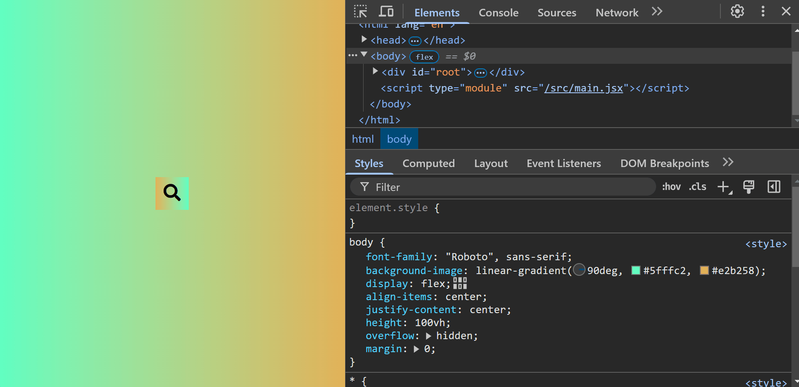

# Interactive Search Bar

This project implements an interactive search bar that expands when the user interacts with it. When you click or focus on the input field, the search bar expands to allow you to enter text, and the search button moves to the right.

## Screenshot

## How to Run

1. Clone the repository or create each project from scratch and the folder and file structure `npm create vite@latest projectName -- --template react`.
2. Navigate to the project folder: `cd interactive-search-bar`.
3. Install the dependencies: `npm install`.
4. Run the project: `npm run dev`.
5. Add `"react/prop-types": 0,` to the package.son file.

## Watch Live

[Watch Live](https://interactive-search-bar.vercel.app/)
