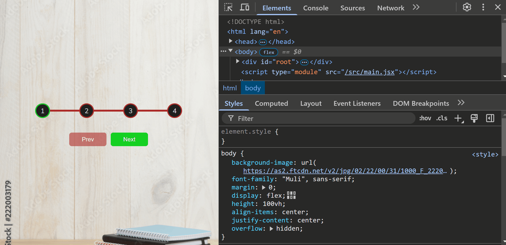

# Progress Steps

This project implements a system of progressive steps (`Progress Steps`). Users can navigate between steps using the "Prev" and "Next" buttons. Each step is represented by a numbered circle, and a progress bar shows the current progress.

## Screenshot

## How to Run

1. Clone the repository or create each project from scratch and follow the folder and file structure `npm create vite@latest projectName -- --template react`.
2. Navigate to the project folder: `cd progress-steps`.
3. Install the dependencies: `npm install`.
4. Run the project: `npm run dev`.
5. Add `"react/prop-types": 0,` to the eslint.config.js file.

## Watch Live

[Watch Live](https://progress-steps-psi.vercel.app/)
