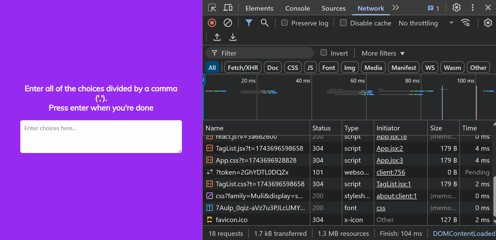

# Random Tag Selector

This project implements a random tag selector where users can input multiple tags separated by commas. When pressing **Enter**, the app highlights tags randomly and selects one as the final result. The selection process includes smooth animations for better user experience.

## Screenshot

## How to Run

1. Clone the repository or create each project from scratch and follow the folder and file structure `npm create vite@latest projectName -- --template react`.
2. Navigate to the project folder: `cd random-tag-selector`.
3. Install the dependencies: `npm install`.
4. Run the project: `npm run dev`.
5. Add `"react/prop-types": 0,` to the eslint.config.js file.

## Watch Live

[Watch Live](https://random-tag-selector.vercel.app/)
