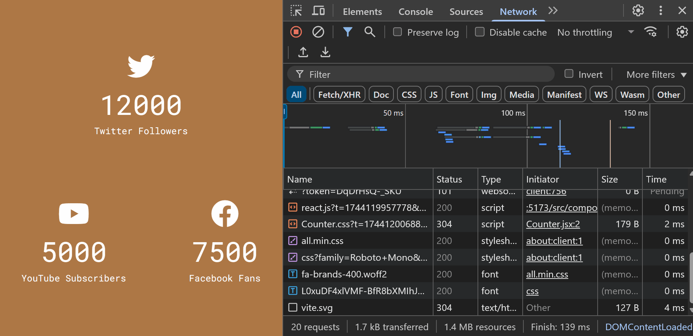

# Social Media Counters

This project implements animated counters for social media metrics such as Twitter followers, YouTube subscribers, and Facebook fans. It's perfect for learning how to manage state and use React's `useEffect` hook for dynamic animations.

## Screenshot

## How to Run

1. Clone the repository or create each project from scratch and follow the folder and file structure `npm create vite@latest projectName -- --template react`.
2. Navigate to the project folder: `cd social-media-counters`.
3. Install the dependencies: `npm install`.
4. Run the project: `npm run dev`.
5. Add `"react/prop-types": 0,` to the eslint.config.js file.

## Watch Live

[Watch Live](https://social-media-counters-beta.vercel.app/)
