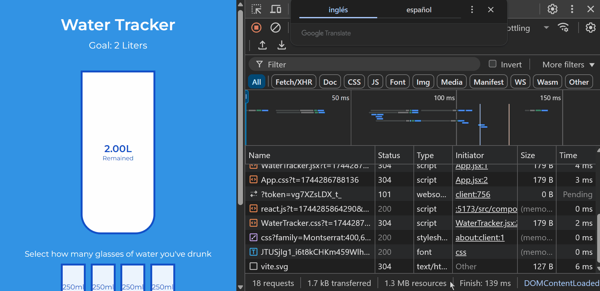

# Water Tracker

This project implements an interactive **Water Tracker** that allows users to track their daily water intake by selecting small cups. The progress is visually represented in a large glass container, and the app includes features like:

- **Persistent State:** The user's progress is saved using `localStorage` so it persists even after refreshing the page.
- **Reset Functionality:** A reset button allows users to clear their progress.
- **Dynamic Calculations:** The app dynamically calculates the percentage of water consumed, the remaining liters, and adjusts the visual representation accordingly.

## Screenshot

## How to Run

1. Clone the repository or create each project from scratch and follow the folder and file structure `npm create vite@latest projectName -- --template react`.
2. Navigate to the project folder: `cd water-tracker`.
3. Install the dependencies: `npm install`.
4. Run the project: `npm run dev`.
5. Add `"react/prop-types": 0,` to the eslint.config.js file.

## Watch Live

[Watch Live](https://water-tracker-beryl-theta.vercel.app/)
